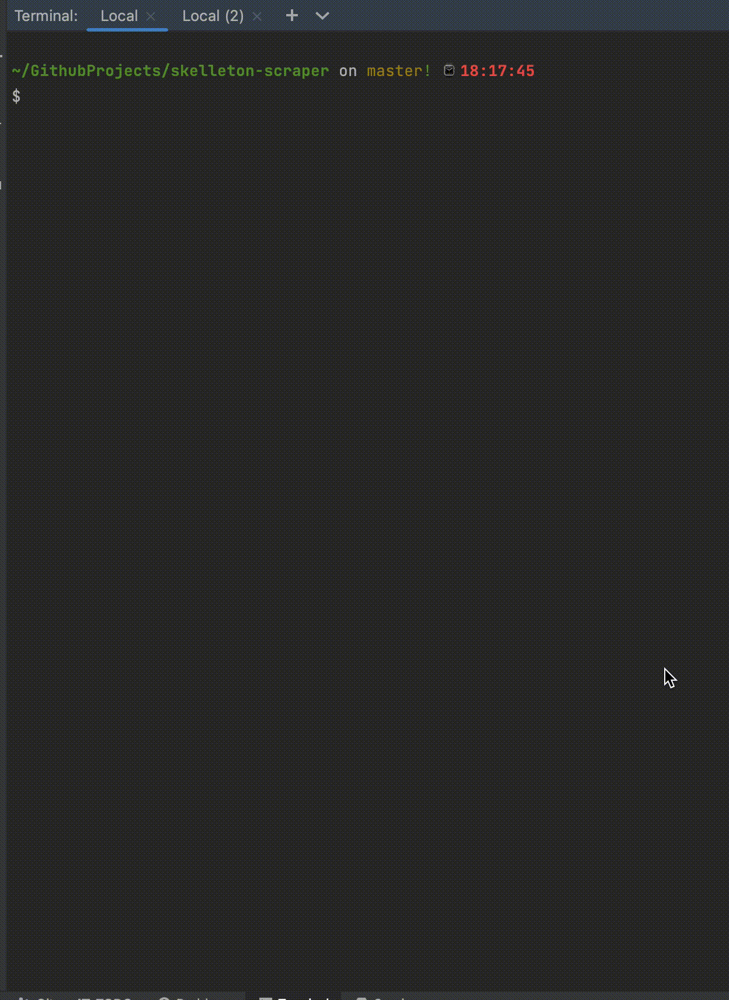

# Skelleton Scraper

Scraper builded with DI (Dependency Injection) for services loading, Puppeteer for Headless browser.
This example scraper fetch the last trending repos from this url [Trending repos](https://github.com/trending) along count stars.

## Features

- Integrated with bunyan logs.
- Easy integration with Microservices.
- Integrated with Prettier and code format precommit webhook.
- Nest.js framework integration.
And more...

### Requirements

- yarn
- node.js
- postgres running in localhost (or any driver that you prefer, see ormconfig.js)
- make and build essentials for Unix

#### How to use

- Run `yarn` to install dependencies
- Run `APP=scraper make build_docker_local`
- Enjoy!

#### Demo
